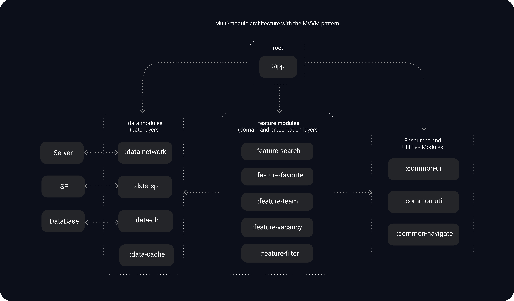
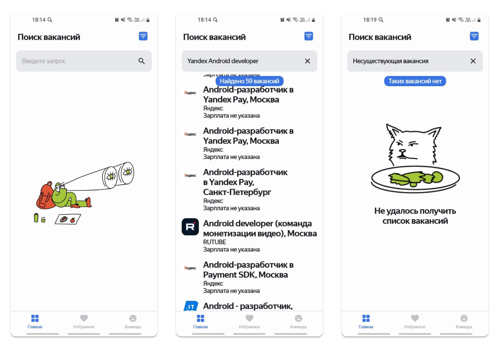
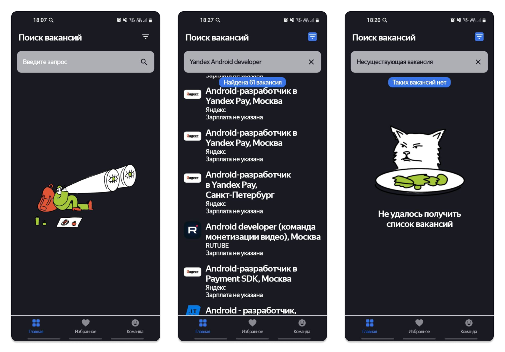
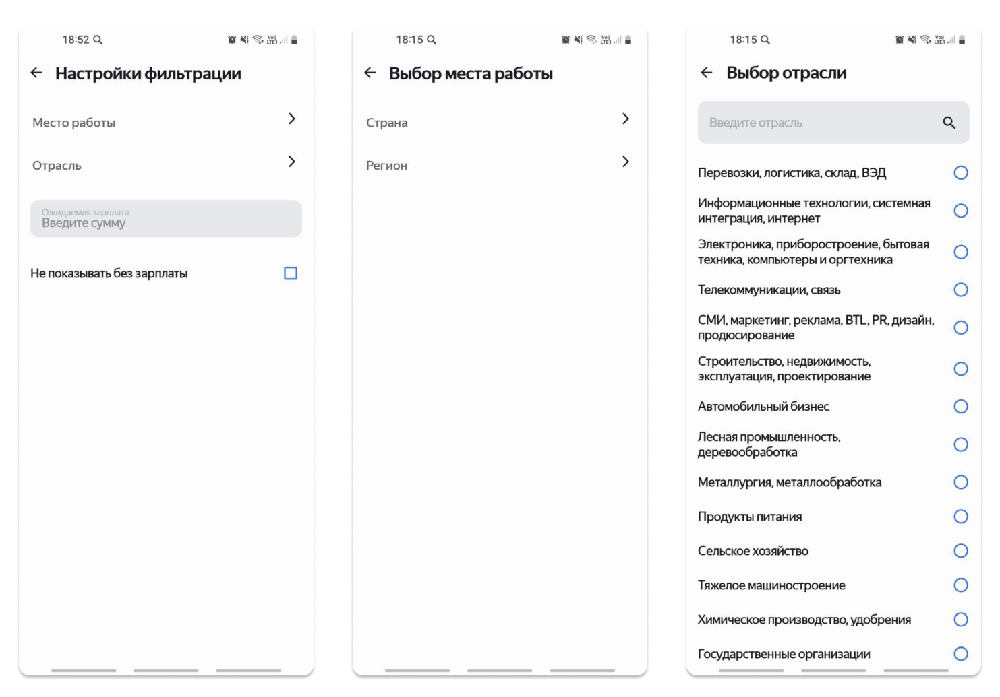
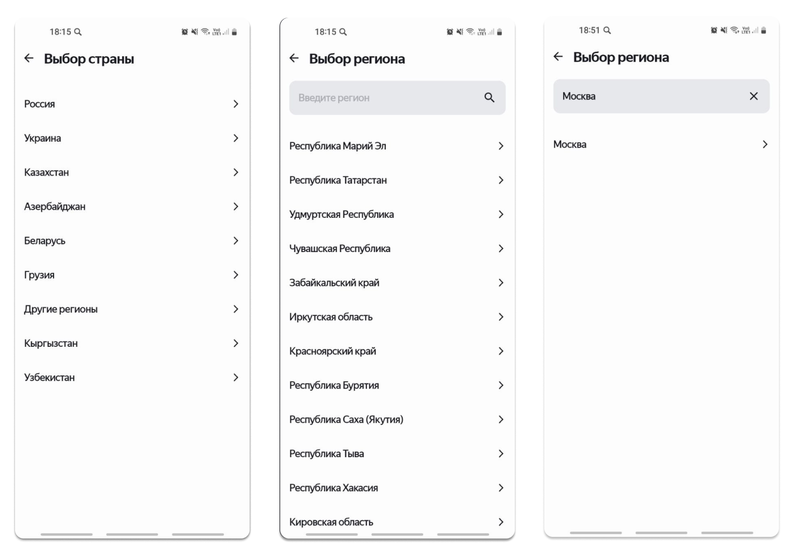
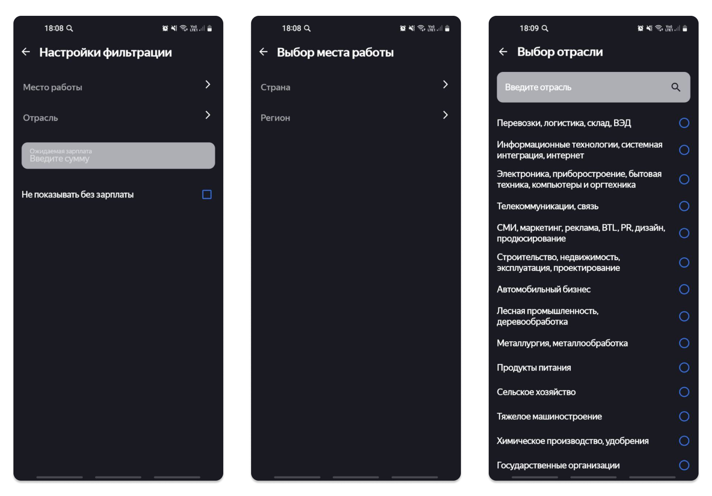
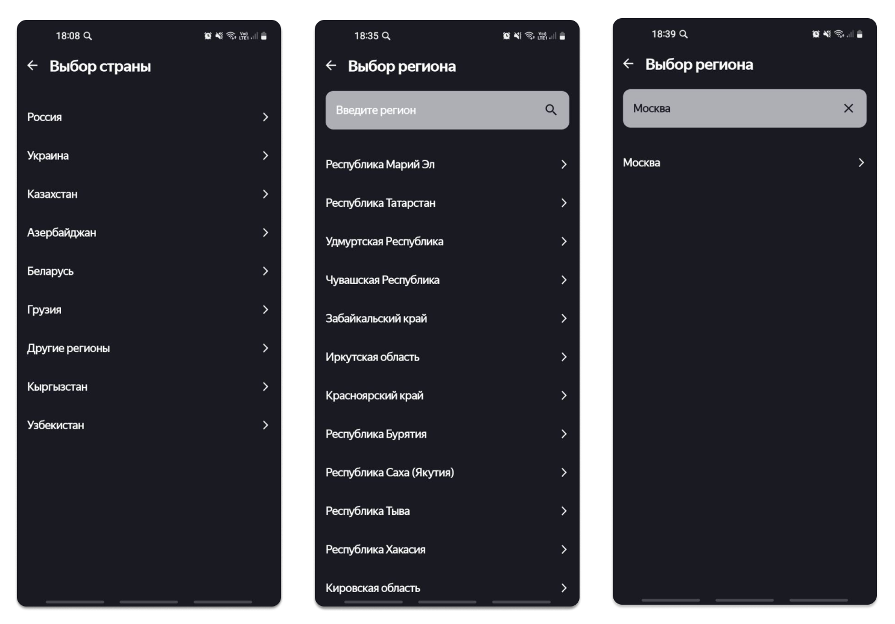
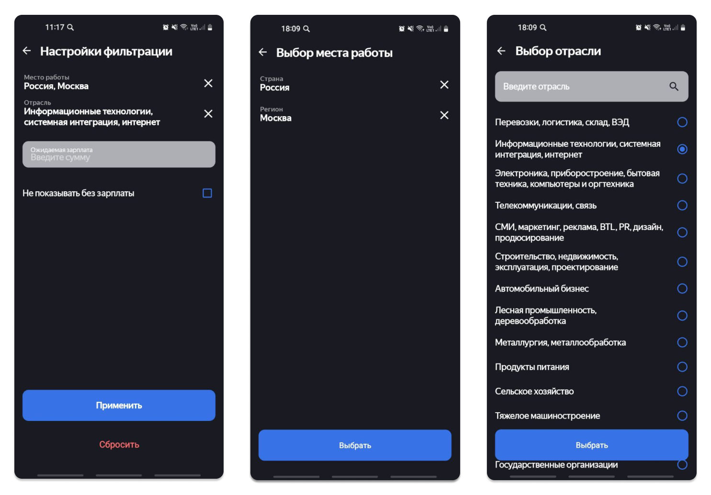
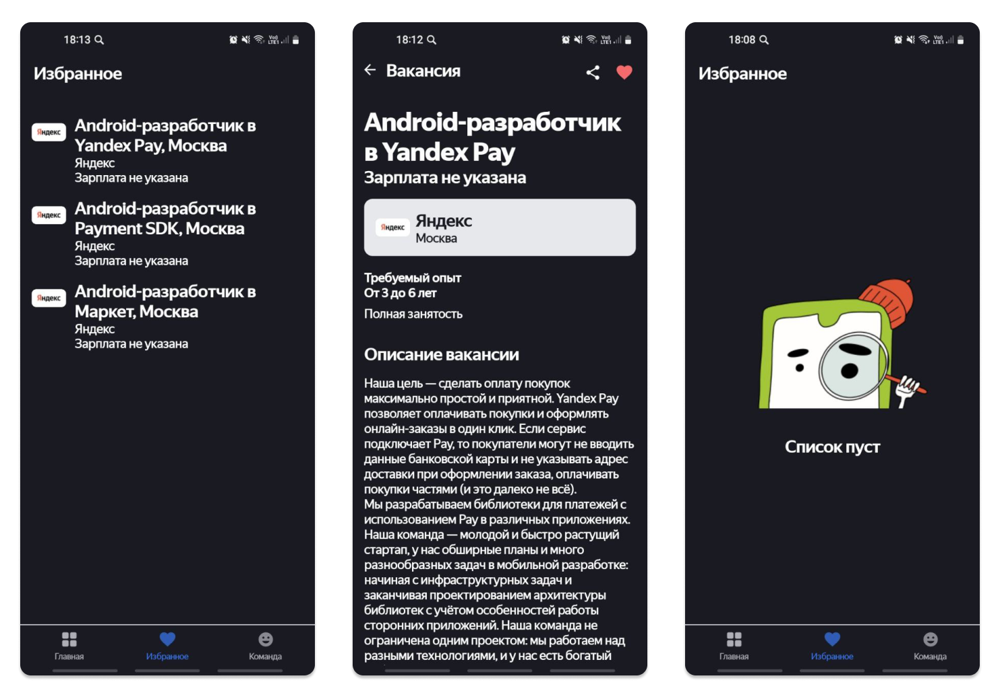
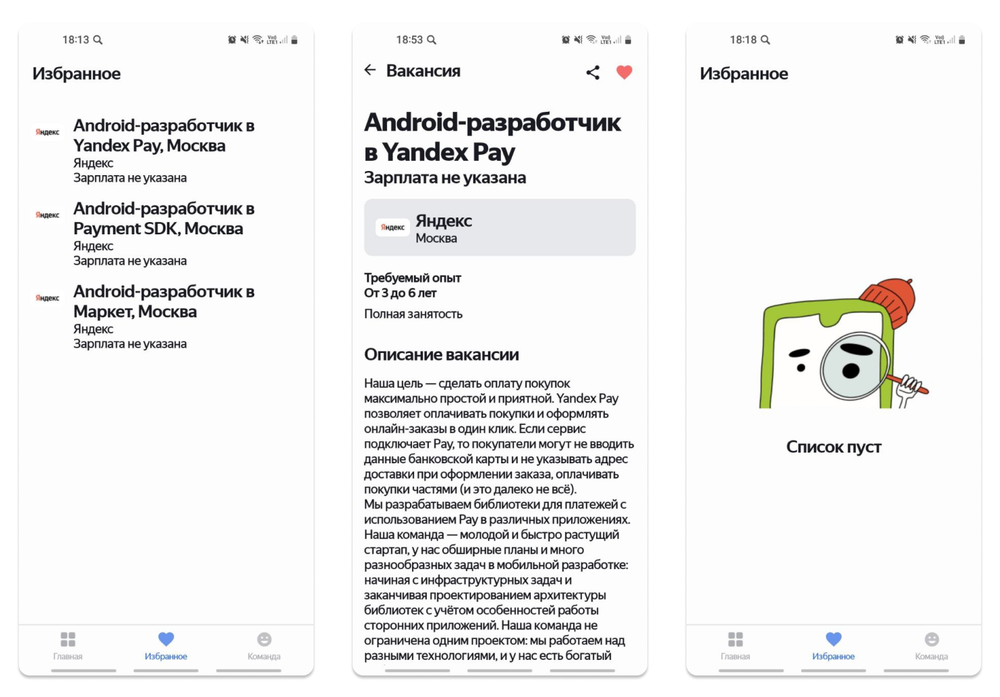

# Дипломный проект Яндекс.Практикума по курсу "Android-разработчик"

## Пример приложения поиска вакансий на сервисе [hh.ru](https://hh.ru/)

## Описание приложения для поиска вакансий
Это учебное приложение предназначено для поиска вакансий на платформе hh.ru, 
предоставляя потенциальным пользователям удобный интерфейс для фильтрации и выбора подходящих предложений. 
Приложение автоматически переключается между светлой и тёмной темами в соответствии с системными настройками, 
что позволяет пользователям комфортно использовать его в любых условиях освещения.

## Основные функции
- **Поиск вакансий**: Пользователи могут искать вакансии по профессии, месту работы и уровню зарплаты, что позволяет быстро находить подходящие предложения.
- **Избранные вакансии**: Возможность добавления вакансий в избранное для быстрого доступа к ним в будущем.
- **Экран описания приложения**: Информация о функционале приложения и его возможностях.

## Используемые технологии
- **Язык программирования**: Kotlin
- **Архитектура**: Multi-module clean architecture, MVVM, Single Activity
- **Сетевые технологии**: REST, Coroutines
- **База данных**: SQLite, SharedPreferences, Cache
- **Библиотеки**:
  - Koin (для внедрения зависимостей)
  - Glide (для загрузки изображений)
  - Gson (для работы с JSON)
  - LiveData (для управления жизненным циклом данных)
  - Retrofit (для сетевых запросов)
  - Room (для работы с локальной базой данных)
  - Android Jetpack (для упрощения разработки)
- **Алгоритм поиска в фильтре**:
Для реализации функции поиска в фильтре используется алгоритм [Кнута-Морриса-Пратта (KMP)](https://ru.wikipedia.org/wiki/Алгоритм_Кнута_—_Морриса_—_Пратта#:~:text=Алгоритм%20Кнута%20—%20Морриса%20—%20Пратта%20(,следующее%20совпадение%2C%20минуя%20лишние%20проверки.)), 
который обеспечивает эффективный поиск подстроки в строке.
Этот алгоритм работает за линейное время от длины обеих строк и позволяет избежать ненужных сравнений, что значительно ускоряет процесс поиска
  
## Пользовательский опыт
Приложение разработано по предоставленному Яндекс.Практикумом утверждённому дизайну с акцентом на удобство и простоту использования.
Интерфейс интуитивно понятен, а функциональность позволяет пользователям легко находить и сохранять интересующие их вакансии.
Автоматическое переключение тем позволяет адаптировать приложение под системные настройки пользователя

# Архитектура приложения

На данной схеме показано отношение между модулями проекта

## Скриншоты приложения:

### Поиск вакансий

### Фильтр поиска

### Избранные вакансии

## Ссылки на источники информации
1) [Яндекс-Практикум](https://practicum.yandex.ru/android-developer/) https://practicum.yandex.ru/android-developer/
2) [Начальная версия приложения Practicum-android-diploma](https://github.com/Yandex-Practicum/practicum-android-diploma) https://github.com/Yandex-Practicum/practicum-android-diploma
3) [Официальная документация API hh.ru](https://api.hh.ru/openapi/redoc#tag/Obshie-spravochniki/operation/get-industries) https://api.hh.ru/openapi/redoc
